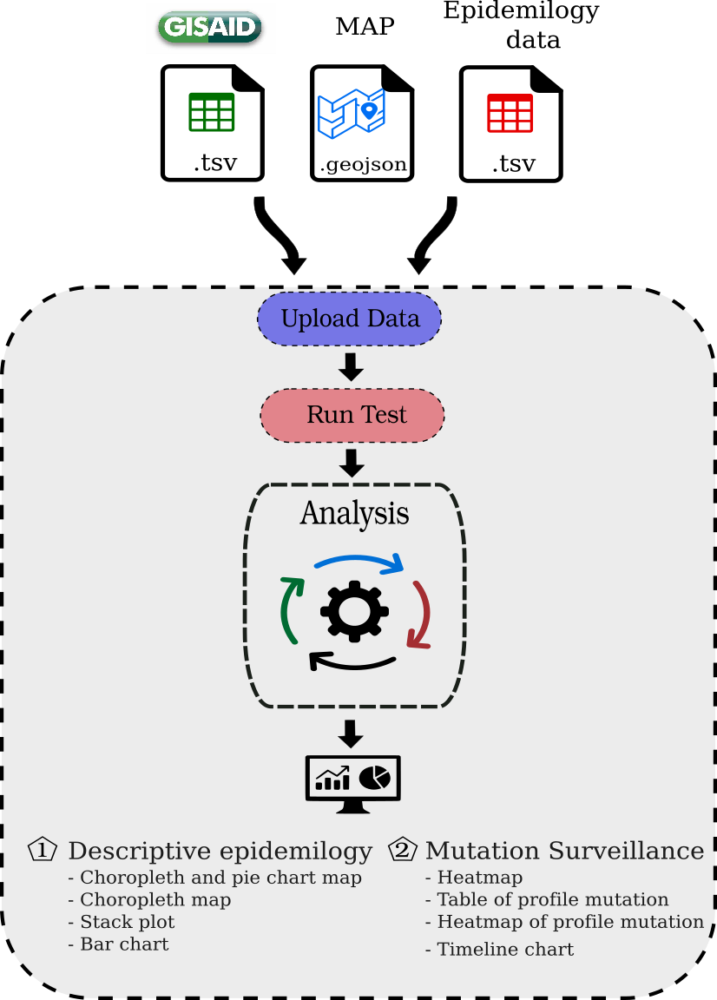

## Documentation

GenomicShiny-Cov was tested in windows 10 and Debian/Ubuntu distros, you must be installed R v.4.0 or higher, is not necessary to install Rstudio to run GenomicShiny-Cov. 

#### System requirements 

*Ubuntu 20.04 / 21.10 / 22.04*  
*Debian 10*  

**Install dependencies for linux ditros**

Install dependencies by aptitude:  
`libprotobuf-dev`  
`libjq-dev`  
`protobuf-compiler`  
`libudunits2-dev`  
`libgdal-dev`  


### Instalation 

To run locally the application must be installed first `shiny` package:
```r 
### shiny installation 
install.packages("shiny")
```

##### Runing from Github
Copy the following link to install and run GenomicShiny-Cov:

```r 
### Copy the link and run in R console  
shiny::runGitHub("GenomicShiny-Cov","FranciscoAscue", 
                    launch.browser = TRUE)
```

##### Clone the repository 

**Linux**
To run locally clone the repository:

```bash
git clone https://github.com/FranciscoAscue/GenomicShiny-Cov.git

cd GenomicShiny-Cov

Rscript app.R
```

**Windows** 

Download the code from the following [LINK](https://github.com/FranciscoAscue/GenomicShiny-Cov/archive/refs/heads/master.zip) and unzipped Open the project in R console : 

```r
runApp(launch.browser = TRUE) 
```
________________________________________________________________________________________________________
### Input Files and Usage



| File  |  Description  |  i.e. |
|:----------:|:-------------:|:-----------:|
|Geojson map | Vectorial map | [GeoJSON](https://github.com/FranciscoAscue/geojson-examples/blob/master/peru_departamental.geojson) |
|Metadata from GISAID | Pacient status metadata from EpiCoV GISAID |  |
|Epidemiology data| Positive or death cases reported | |
