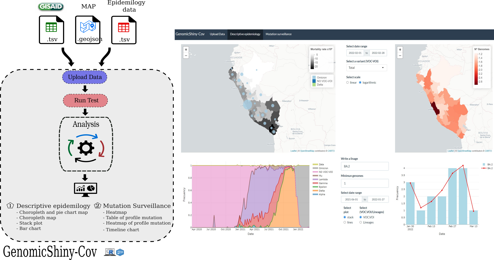

# GenomicShiny-Cov

GenomicShiny-Cov is a shiny application for genomics surveillance. This application takes tsv files and geojson to plot interactive graphs to show the epidemiological and genomics status of the pandemic.

see [Documentation](doc.md)

## Input data

### GISAID patient status .tsv   
The app can upload metadata of patient status downloaded from the international database GISAID

### Epidemiological data of positive cases and death reported .tsv/.csv   
The epidemiological of positive cases have two principal headers label: Date of report and Location 

### Vectorial map in GeoJson format   
The vectorial map can be upload from URL and directly in geojson format  
